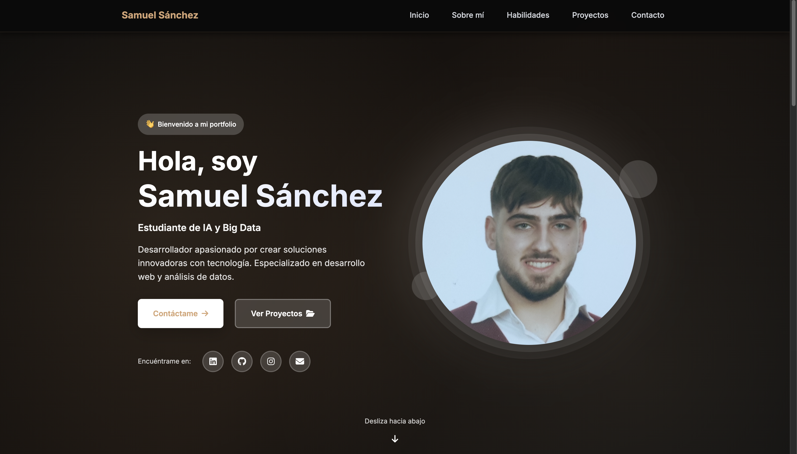

# Portfolio Personal - Samuel Sánchez Heredia

Portfolio personal profesional desarrollado con HTML5, CSS3 y JavaScript vanilla. Diseño moderno, responsive y optimizado para una excelente experiencia de usuario.

## 🌟 Características

- ✨ Diseño moderno y minimalista
- 📱 Totalmente responsive (mobile-first)
- ⚡ Rendimiento optimizado
- 🎨 Animaciones suaves y profesionales
- 🌐 Compatible con todos los navegadores modernos
- ♿ Accesible (ARIA labels y semántica HTML)
- 🔝 Botón scroll to top
- 💫 Efectos de scroll reveal

## 🚀 Demo en Vivo

[Ver Portfolio en Vivo](https://samuelsanchezheredia.github.io/portfolio)

## 📋 Secciones

1. **Hero/Inicio** - Presentación principal con enlaces a redes sociales
2. **Sobre Mí** - Información personal y profesional
3. **Habilidades** - Skills técnicas con barras de progreso animadas
4. **Proyectos** - Galería de proyectos destacados
5. **Contacto** - Formulario de contacto y enlaces directos
6. **Footer** - Información adicional y redes sociales

## 🛠️ Tecnologías Utilizadas

- **HTML5** - Estructura semántica
- **CSS3** - Estilos modernos con:
  - CSS Grid & Flexbox
  - Variables CSS (Custom Properties)
  - Animaciones y transiciones
  - Media queries para responsive
- **JavaScript (ES6+)** - Interactividad:
  - Menú móvil
  - Scroll activo
  - Animaciones on scroll
  - Lazy loading
  - Debouncing para performance
- **Font Awesome** - Iconos
- **Google Fonts** - Tipografía (Inter)
- **Webpack** - Bundler y optimización

## 📄 Licencia

Este proyecto está bajo la Licencia MIT - ver el archivo [LICENSE.txt](LICENSE.txt) para más detalles.

## 👤 Autor

**Samuel Sánchez Heredia**

- LinkedIn: [@samuelsanchezheredia](https://www.linkedin.com/in/samuelsanchezheredia/)
- GitHub: [@samuelsanchezheredia](https://github.com/samuelsanchezheredia)
- Email: samusanhe@gmail.com

## 🙏 Agradecimientos

- [Font Awesome](https://fontawesome.com/) por los iconos
- [Google Fonts](https://fonts.google.com/) por la tipografía
- [HTML5 Boilerplate](https://html5boilerplate.com/) por la base inicial
- Comunidad de desarrolladores por la inspiración

## 📊 Estado del Proyecto

---
