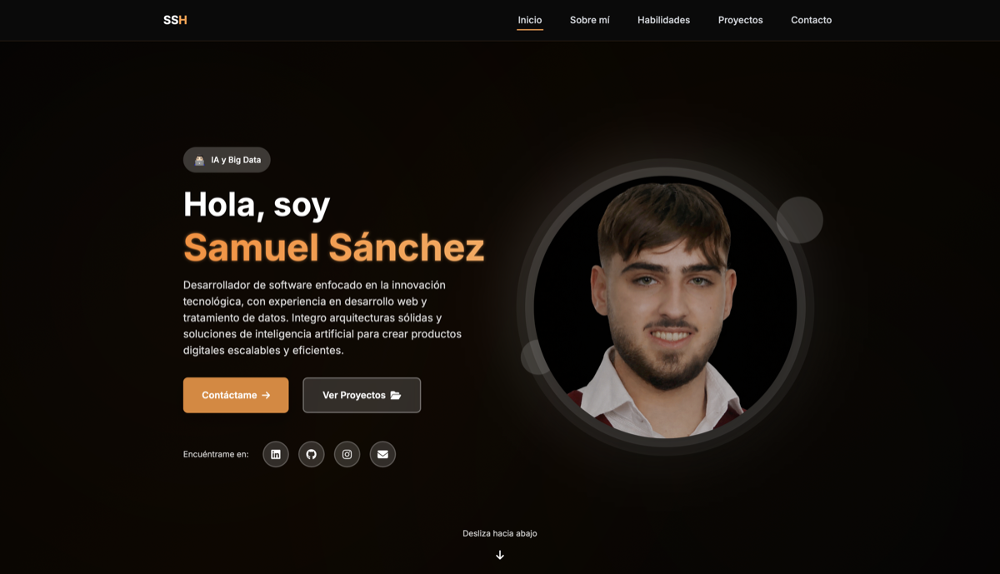

# Portfolio de Samuel Sánchez Heredia



Portfolio personal desarrollado con HTML5, CSS3 y JavaScript vanilla. Presenta experiencia en desarrollo web, IA y Big Data mediante una interfaz responsive, accesible y optimizada para carga rápida.

## Desarrollo local

Requisitos: Node.js y npm.

```bash
npm install
npm start
```

El servidor de desarrollo abre el portfolio en `http://localhost:8080` y activa recarga en caliente. Para generar la versión de producción:

```bash
npm run build
```

El resultado se genera en `dist/`.

## Características

- Navegación responsive con menú móvil accesible.
- Hero con CTA, redes sociales y CV descargable.
- Secciones de presentación, habilidades, proyectos y contacto.
- Galería lightbox con navegación por botones y teclado.
- Scroll activo, botón para volver arriba y reveals con `IntersectionObserver`.
- Soporte para `prefers-reduced-motion` y estados de foco visibles.
- Imágenes inferiores con `loading="lazy"`, `decoding="async"` y dimensiones explícitas.
- Metadatos SEO básicos, manifest PWA y favicon.

## Optimizaciones aplicadas

- Se consolidaron los listeners de scroll en un único ciclo `requestAnimationFrame` con listener pasivo.
- Se eliminó lógica duplicada y se protegieron elementos opcionales con comprobaciones seguras.
- El script se carga con `defer` y la imagen de perfil se precarga con alta prioridad.
- Se redimensionaron los assets al tamaño útil de pantalla. El directorio de imágenes pasó de aproximadamente 21 MB a 3.8 MB.
- Se corrigió la configuración de producción para no copiar rutas inexistentes.
- El build de producción queda en aproximadamente 3.75 MiB, con avisos informativos para imágenes todavía grandes.

## Estructura

- `index.html`: estructura semántica y contenido.
- `css/style.css`: sistema visual, responsive y accesibilidad.
- `js/app.js`: interacciones y rendimiento en cliente.
- `img/`: imágenes optimizadas del portfolio.
- `files/`: CV y guía para sustituirlo.
- `webpack.config.*`: desarrollo y build de producción.

## Verificación

Comandos ejecutados tras los cambios:

- `node --check js/app.js`
- `npm run build`

El build compila correctamente. Webpack todavía avisa de que `preview.png`, `profile.png`, `project2.png` y `project4.jpg` superan su umbral recomendado de 244 KB; se mantienen así para preservar calidad visual y porque ya se redujo el peso total de imágenes en torno a un 82 %.

`npm install` puede mostrar vulnerabilidades en dependencias de desarrollo heredadas. Revisarlas con `npm audit` antes de publicar una cadena de build en CI.

## Demo

[Portfolio publicado](https://samuelsanchezheredia.github.io/portfolio)

## Autor

**Samuel Sánchez Heredia**

- [LinkedIn](https://www.linkedin.com/in/samuelsanchezheredia/)
- [GitHub](https://github.com/samuelsanchezheredia)
- [Email](mailto:samusanhe@gmail.com)

## Licencia

Este proyecto está bajo la Licencia MIT. Consulta [LICENSE.txt](LICENSE.txt).
